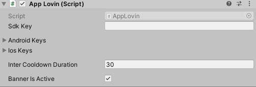

# AppLovinIntegration


# How Init ?
```csharp
[DefaultExecutionOrder(-1000)]
sealed class ServicesInit : MonoBehaviour
{
   [SerializeField] AppLovin _appLovinPrefab;
   static AppLovin instance {private set; get; }

    void Awake()
    {
        AppLovinInit();
    }
    
    void AppLovinInit()
    {
        if (instance != null) return;
        instance = Instantiate(_appLovinPrefab);
        DontDestroyOnLoad(instance.gameObject);
    }
}
```
